> Роботу виконав: Ліпкін Артем, Безродних Олександр, Клименко Назарій
<p align="center">
СРС_WORK-CASE №2
</p>


## Завдання 2. Базові дії в гіпервізорі VirtualBox

### 2.1. Створення нової віртуальної машини

1. У головному вікні VirtualBox натиснути **«Створити»** (New).
2. **Ім'я та тип ОС:**
   - Ім'я: `Ubuntu-Desktop`;
   - Папка: `D:\VirtualBox VMs`;
   - ОС: `Linux`, дистрибутив: `Ubuntu`, версія: `Ubuntu (64-bit)`;
   - Образ ISO можна вказати одразу або підключити пізніше (див. [2.2](#22-вибір-і-додавання-обладнання)). Без ISO прапорець «Здійснити встановлення автоматично» недоступний — ОС встановлюється вручну.

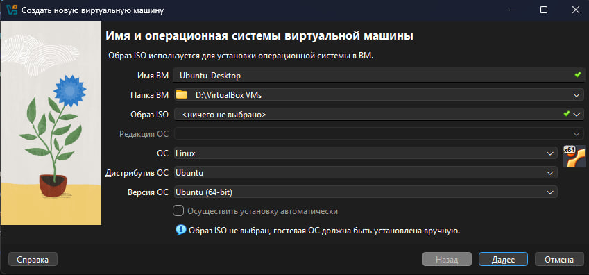

*Рисунок 1 — Майстер створення ВМ: ім'я, папка та тип операційної системи*

3. **Обладнання:**
   - Основна пам'ять: **4096 МБ** (пізніше збільшено до 6144 МБ — рекомендовано для Ubuntu 26.04);
   - Кількість процесорів: **4**;
   - Прапорець «Використовувати EFI» — **вимкнено** (використовується BIOS).
4. **Жорсткий диск:** створити новий віртуальний диск розміром **30 ГБ**.

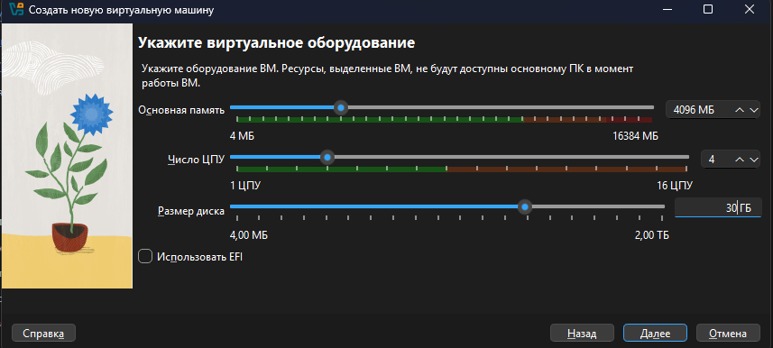

*Рисунок 2 — Майстер створення ВМ: оперативна пам'ять, процесори, розмір диска*

5. Натиснути **«Готово»**. Віртуальна машина з'являється у списку головного вікна, праворуч — зведення її налаштувань.

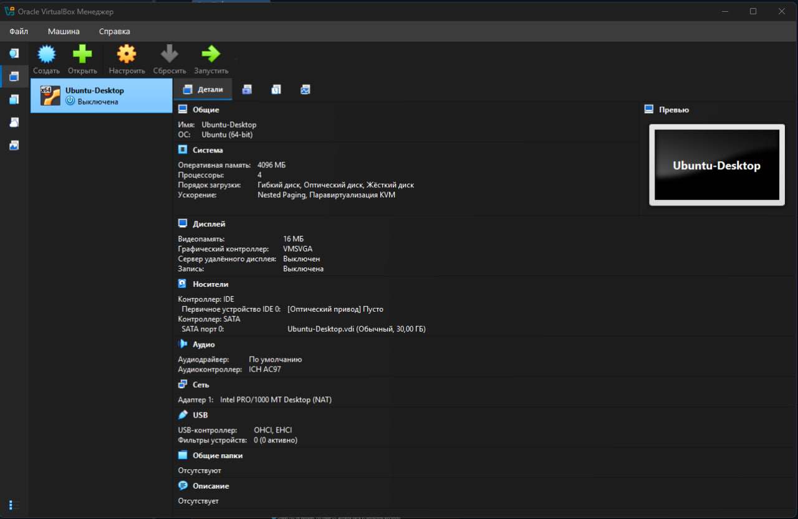

*Рисунок 3 — Головне вікно VirtualBox Менеджер зі створеною віртуальною машиною (налаштування за замовчуванням)*

#### BIOS чи UEFI

Ubuntu працює з обома варіантами; для віртуальної машини обрано BIOS як простіший.

#### Формат віртуального диска

Віртуальний диск — це звичайний файл на диску хоста. У VirtualBox 7.2 у звичайному режимі майстра тип диска не запитується: за замовчуванням створюється диск **VDI** з **динамічним** розміром (файл росте в міру заповнення). Інші параметри доступні в **«Експертному режимі»** майстра.
---

### 2.2. Вибір і додавання обладнання

Після створення віртуальної машини все обладнання налаштовується у вікні **«Налаштувати»** (Settings). Більшість параметрів можна змінювати лише при вимкненій ВМ.

| Розділ | Що налаштовується | Використані значення |
|---|---|---|
| **Загальні → Додатково** | Спільний буфер обміну, Drag'n'Drop між хостом і ВМ | обидва — «Двонаправлений» |
| **Система → Материнська плата** | Обсяг ОЗП, порядок завантаження, чипсет, EFI | 4096 МБ, BIOS |
| **Система → Процесор** | Кількість віртуальних ЦП, PAE/NX | 4 ЦП |
| **Дисплей → Екран** | Відеопам'ять, графічний контролер, кількість моніторів, 3D‑прискорення | 128 МБ, VMSVGA |
| **Носії** | Контролери (IDE, SATA, SCSI, NVMe, USB), жорсткі диски, оптичні приводи | SATA: диск VDI + привід з ISO |
| **Аудіо** | Звуковий контролер та драйвер хоста | за замовчуванням |
| **Мережа** | До 4 мережевих адаптерів, режим підключення, тип адаптера | Адаптер 1: NAT / Мережевий міст |
| **USB** | Контролер USB 1.1 / 2.0 / 3.0, фільтри USB‑пристроїв | USB 2.0, фільтр для телефона |
| **Спільні папки** | Папки хоста, доступні у ВМ | — |

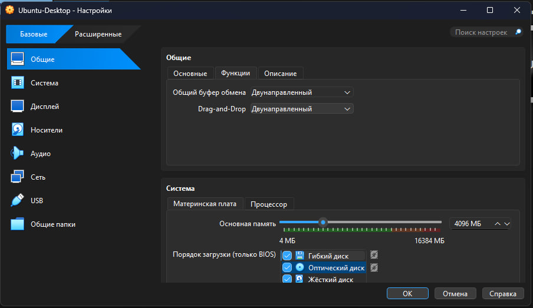

*Рисунок 4 — Налаштування: спільний буфер обміну та Drag‑and‑Drop, основна пам'ять і порядок завантаження*

---

### 2.3. Налаштування мережі та підключення до Wi‑Fi

VirtualBox дає віртуальній машині **віртуальну мережеву карту** (у моєму випадку — Intel PRO/1000 MT Desktop, 82540EM). Для кожного з 4 адаптерів обирається **тип підключення**:

| Режим | ВМ ↔ Інтернет | ВМ ↔ хост | ВМ ↔ інші пристрої мережі | Застосування |
|---|---|---|---|---|
| **NAT** (за замовчуванням) | ✅ | ❌ (лише через проброс портів) | ❌ | звичайна робота, інтернет «через хост» |
| **Мережа NAT** | ✅ | ❌ | ❌ (але ВМ бачать одна одну) | кілька ВМ в одній підмережі |
| **Мережевий міст** | ✅ | ✅ | ✅ | ВМ як окремий пристрій у домашній мережі |
| **Віртуальний адаптер хоста** | ❌ | ✅ | ❌ | ізольована мережа «хост + ВМ» |
| **Внутрішня мережа** | ❌ | ❌ | ❌ (лише між ВМ) | ізольовані лабораторні мережі |
| **Не підключено** | ❌ | ❌ | ❌ | «кабель витягнуто» |

#### Підключення до точок Wi‑Fi

Віртуальна машина **не може самостійно обрати точку доступу Wi‑Fi**. VirtualBox завжди надає гостьовій ОС **віртуальну дротову (Ethernet) карту**, тому інсталятор Ubuntu показує «Пристрої Wi‑Fi не виявлено» (рис. 8). До якої Wi‑Fi‑мережі підключатися, вирішує **хост (Windows)**, а ВМ користується цим підключенням:

- у режимі **NAT** — «ховається» за хостом;
- у режимі **мосту** — виходить у мережу через Wi‑Fi‑адаптер хоста з власною IP‑адресою.

Щоб віртуальна машина працювала з Wi‑Fi **напряму** (бачила список мереж і сама підключалася), можна:

1. **Прокинути у ВМ USB Wi‑Fi‑адаптер** через меню «Пристрої → USB» — тоді Ubuntu побачить його як власну бездротову карту.
2. Використати **USB‑модем телефона** (режим *USB tethering*), прокинутий у ВМ, — тоді ВМ отримає окреме підключення до Інтернету через телефон, незалежне від Wi‑Fi хоста.

---

### 2.4. Робота із зовнішніми носіями

#### Робота з флешкою в Linux

У Linux немає букв дисків (C:, D:) — будь‑який носій треба **змонтувати**, тобто підключити до певної папки в єдиному дереві файлів:

```bash
lsblk                        # список дисків; флешка з'явиться як /dev/sdb
sudo mkdir -p /mnt/usb       # папка для підключення
sudo mount /dev/sdb1 /mnt/usb  # змонтувати перший розділ флешки
ls /mnt/usb                  # переглянути вміст
sudo umount /mnt/usb         # безпечно від'єднати перед вилученням
```

Назви пристроїв у Linux:

| Пристрій | Що це |
|---|---|
| `/dev/sda`, `/dev/sdb` | SATA/SCSI/USB‑диски, у т.ч. флешки (буква — порядковий номер) |
| `/dev/sda1`, `/dev/sda2` | розділи на диску `sda` |
| `/dev/nvme0n1` | NVMe SSD |
| `/dev/sr0` | оптичний привід |

Цю ж процедуру монтування виконано на практиці для віртуального CD з Доповненнями гостьової ОС (`/dev/sr0`, див. [3.3](#33-встановлення-доповнень-гостьової-ос)).

#### Експеримент — прокидання смартфона

Замість флешки у ВМ прокидався смартфон **Samsung Galaxy S25 Ultra** у режимі передачі файлів.

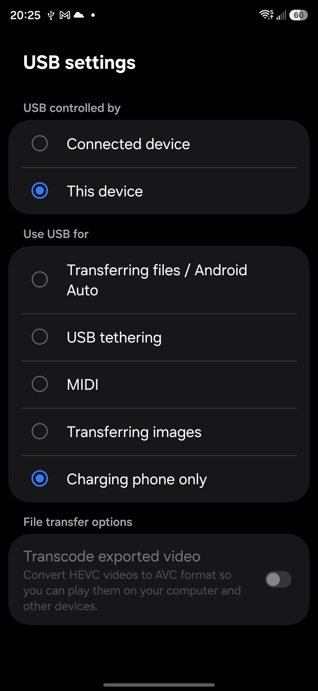

*Рисунок 5 — Налаштування USB на телефоні: режими роботи USB (передача файлів MTP, USB‑модем, MIDI, передача зображень PTP, лише заряджання)*

Хід роботи:

1. На телефоні обрано режим **Transferring files** — у режимі «Charging phone only» передача даних вимкнена, і файли не видно навіть у Windows.
2. Додано **фільтр USB** для `Samsung Electronics Co., Ltd Galaxy (MTP)`.
3. VirtualBox **захопив** пристрій у Windows (стан `Captured`), але до гостьової ОС він не дійшов — `lsusb` в Ubuntu телефона не показав.

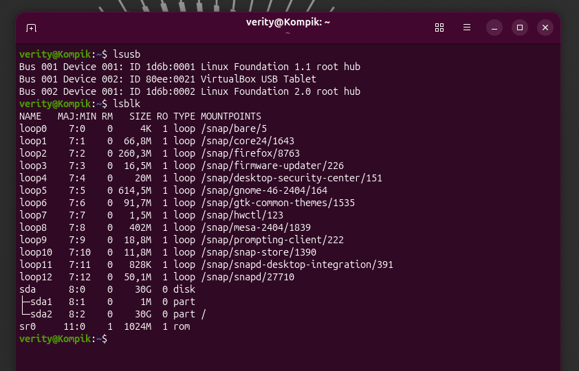

*Рисунок 6 — Вивід `lsusb` (USB‑пристрої) та `lsblk` (блокові пристрої) у гостьовій ОС*

Причина: при зміні режиму USB телефон **перепідключається** як новий пристрій, і в Windows залишився «привид» старого підключення, який утримував драйвер Samsung. Смартфон — **складений (composite) пристрій** (MTP + модем + ADB), і фірмові драйвери Windows намагаються забрати його собі першими. Тобто прокидання USB працює не з усіма пристроями однаково надійно.

#### Флешка vs смартфон: різні протоколи

| | Флешка | Смартфон |
|---|---|---|
| Протокол | **USB Mass Storage** | **MTP** (Media Transfer Protocol) |
| Як бачить Linux | як **блоковий пристрій** `/dev/sdX` | як USB‑пристрій, **не як диск** |
| У `lsblk` | ✅ є | ❌ немає |
| Доступ до файлів | `mount` / файловий менеджер | лише програми з підтримкою MTP (файловий менеджер «Файли») |
| Форматування | можна | не можна |

---

## Завдання 3. Встановлення Ubuntu з графічною оболонкою

### 3.1. Вибір дистрибутиву та завантаження образу

Обрано **Ubuntu 26.04.1 LTS Desktop** — найновіший випуск з довгостроковою підтримкою, з графічною оболонкою **GNOME**.

Образ завантажено з офіційного сайту `releases.ubuntu.com` (6,04 ГБ) і перевірено **контрольну суму SHA256**:

```powershell
Get-FileHash ubuntu-26.04.1-desktop-amd64.iso -Algorithm SHA256
```

```
601e30fbf5d97759367c632e2c33630665039b7e2158fd068403da3ccf1bda1f  ✅ збігається з офіційним SHA256SUMS
```

Контрольна сума — «відбиток» файлу: якщо при завантаженні пошкодився хоча б один байт або образ підмінено, відбиток буде іншим. У Linux для цього використовується команда `sha256sum`.


### 3.2. Процес встановлення

1. У меню завантажувача **GRUB** обрати **Try or Install Ubuntu**.

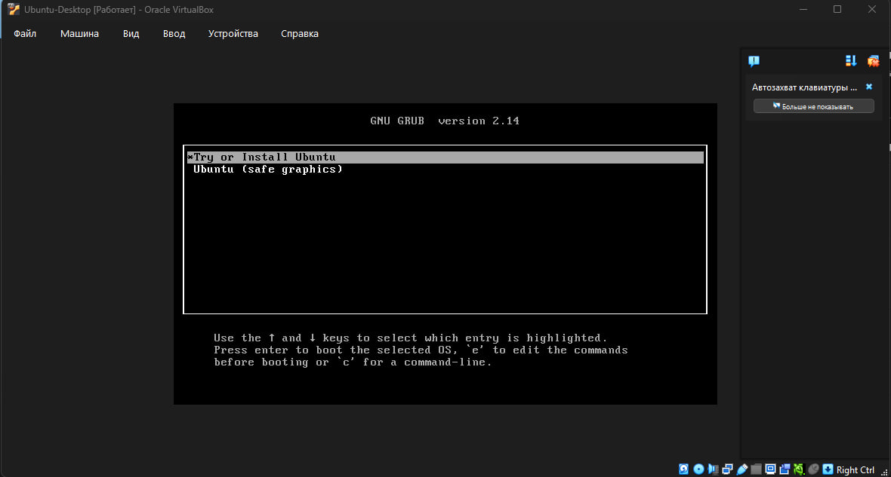

*Рисунок 7 — Меню завантажувача GNU GRUB 2.14 з інсталяційного образу*

2. Мова інтерфейсу, розкладка клавіатури.
3. **Підключення до мережі** — «Використовувати дротове підключення» (у ВМ є лише віртуальна Ethernet‑карта, див. [2.3](#23-налаштування-мережі-та-підключення-до-wifi)).

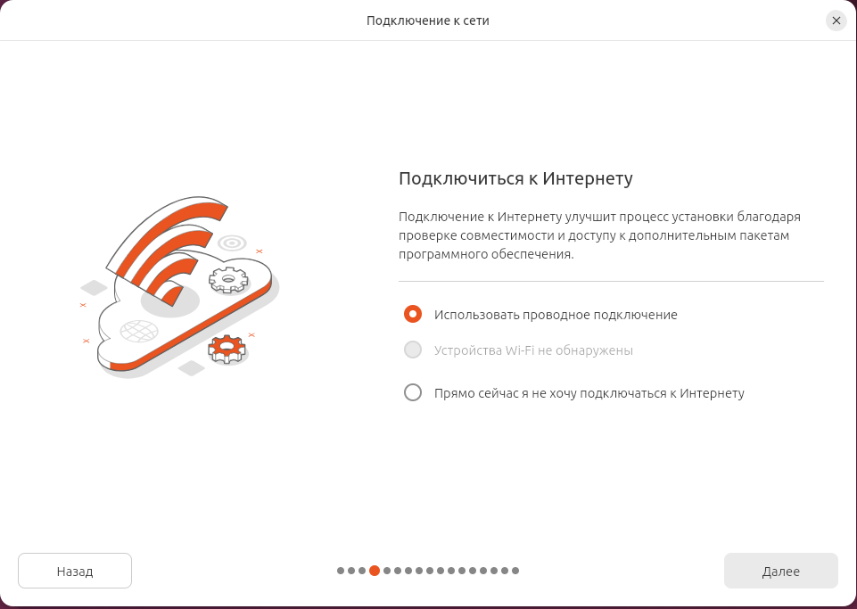

*Рисунок 8 — Інсталятор: підключення до мережі (Wi‑Fi‑пристроїв не виявлено)*

4. **Встановити Ubuntu** → інтерактивне встановлення → стандартний набір програм → стороннє ПЗ (драйвери, кодеки).
5. **Розмітка диска** — «Стерти диск і встановити Ubuntu» (стирається лише віртуальний диск `Ubuntu-Desktop.vdi`; реальні диски хоста ВМ не бачить). Файлова система — **ext4**.
6. **Шифрування** — «Без шифрування»:

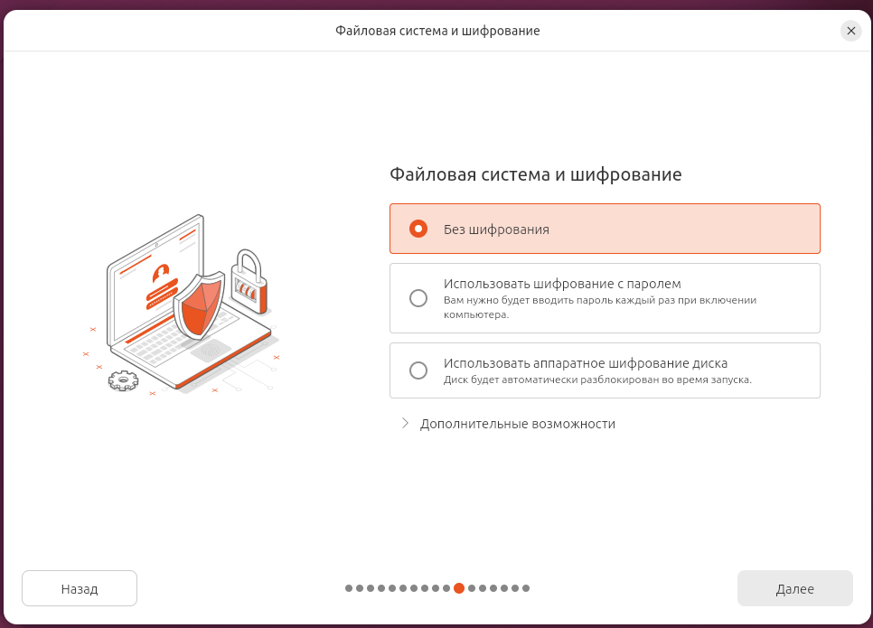

*Рисунок 9 — Вибір шифрування диска*

7. Обліковий запис (ім'я користувача `---`, ім'я комп'ютера `---`), часовий пояс — Kyiv.
8. Встановлення (≈ 10–15 хв) → **«Перезавантажити зараз»**.

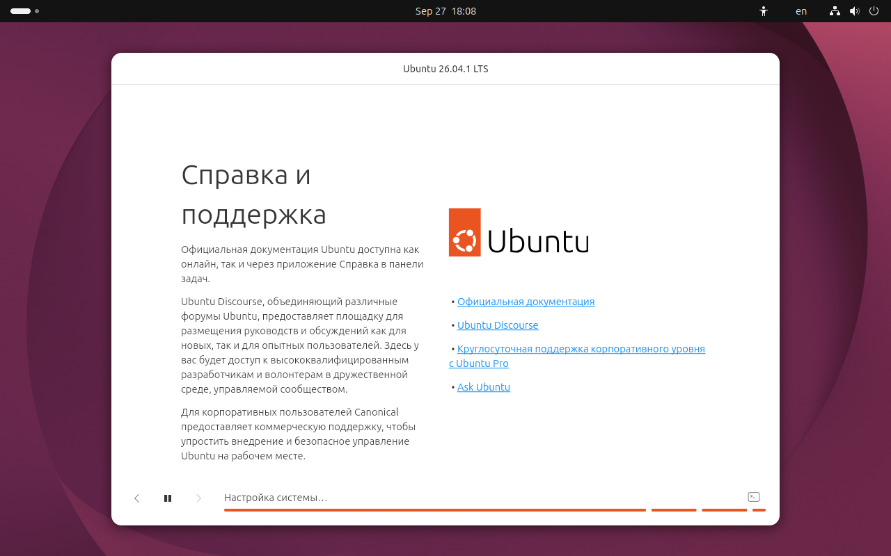

*Рисунок 10 — Процес встановлення Ubuntu 26.04.1 LTS*

Після перезавантаження система успішно запустилася — Ubuntu встановлена та працює:

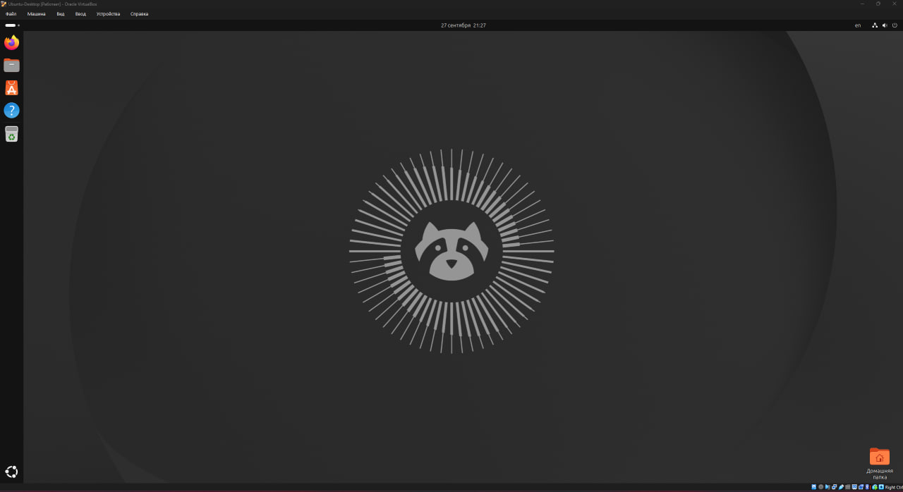

*Рисунок 11 — Робочий стіл встановленої Ubuntu 26.04.1 LTS (GNOME) у вікні VirtualBox*

### 3.3. Встановлення Доповнень гостьової ОС

**Доповнення гостьової ОС** (Guest Additions) — набір драйверів і служб VirtualBox для гостьової системи. Вони забезпечують автоматичну зміну роздільності екрана під розмір вікна, спільний буфер обміну, Drag'n'Drop та спільні папки.

Після встановлення Ubuntu працювала лише вбудована в ядро Linux стара версія (`6.0.0`, рівень 1). Встановлено актуальну версію **7.2.20**:

```bash
# 1. Інструменти для компіляції модулів ядра
sudo apt update
sudo apt install -y build-essential bzip2 linux-headers-$(uname -r)

# 2. У вікні VirtualBox: Пристрої → «Підключити образ Доповнень гостьової ОС…»

# 3. Ubuntu не змонтувала CD автоматично — монтуємо вручну
sudo mkdir -p /mnt/cdrom
sudo mount /dev/sr0 /mnt/cdrom

# 4. Запуск інсталятора (компіляція модулів ядра)
sudo sh /mnt/cdrom/VBoxLinuxAdditions.run

# 5. Перезавантаження
sudo reboot
```

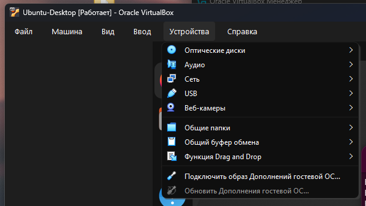

*Рисунок 12 — Меню «Пристрої» → «Підключити образ Доповнень гостьової ОС…»*

Після перезавантаження VirtualBox підтвердив версію доповнень **7.2.20** і підтримку графіки: роздільність екрана автоматично підлаштовується під розмір вікна.

>Comitted by Артем Ліпкін

Завдання 4: мінімальна установка Linux, GNOME та друга графічна оболонка

**Дистрибутив:** Debian GNU/Linux 13 (Trixie), netinst
**Гіпервізор:** Oracle VirtualBox
**Параметри ВМ:** 1 ГБ RAM, віртуальний диск VDI (динамічний) 10 ГБ

## 4.1. Мінімальна установка (термінал, без GUI)

Встановлення виконано з образу `netinst` у текстовому режимі. Розбиття диска — автоматичне: «З допомогою — використати весь диск».

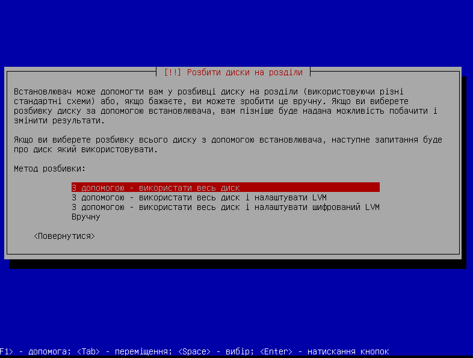

Схема розбиття — «Всі файли в одному розділі».

Ключовий крок — вибір ПЗ (tasksel). Усі графічні оболонки **не обрані**, залишено лише «SSH-сервер» та «Стандартні системні утиліти».

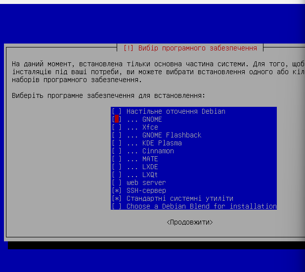

Вхід у систему в текстовому режимі: графічного інтерфейсу немає.

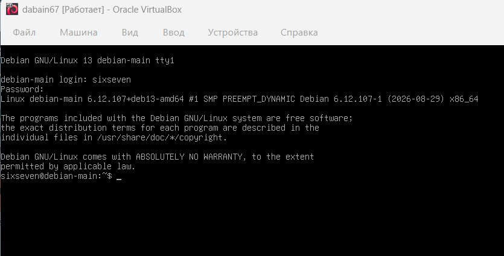

Перевірка мережі (`ping`) та перехід до root (`su -`), оскільки `sudo` у мінімальній установці відсутній.

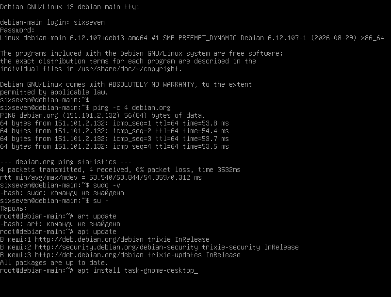

## 4.2. Встановлення GNOME поверх мінімальної системи

Команди (від root):

```bash
apt update
apt install task-gnome-desktop
```

Підтвердження встановлення: 1241 пакет, 883 МБ завантаження.

Завершення встановлення `task-gnome-desktop` (попередження `gdm.service is not active` очікуване, бо система ще не перезавантажувалась).

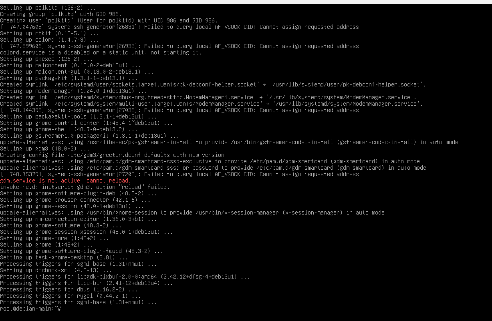

Графічний екран входу GDM.

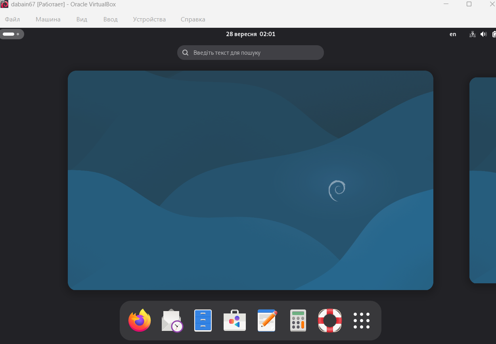

Використання ресурсів у сесії GNOME (`free -h`, `df -h /`).

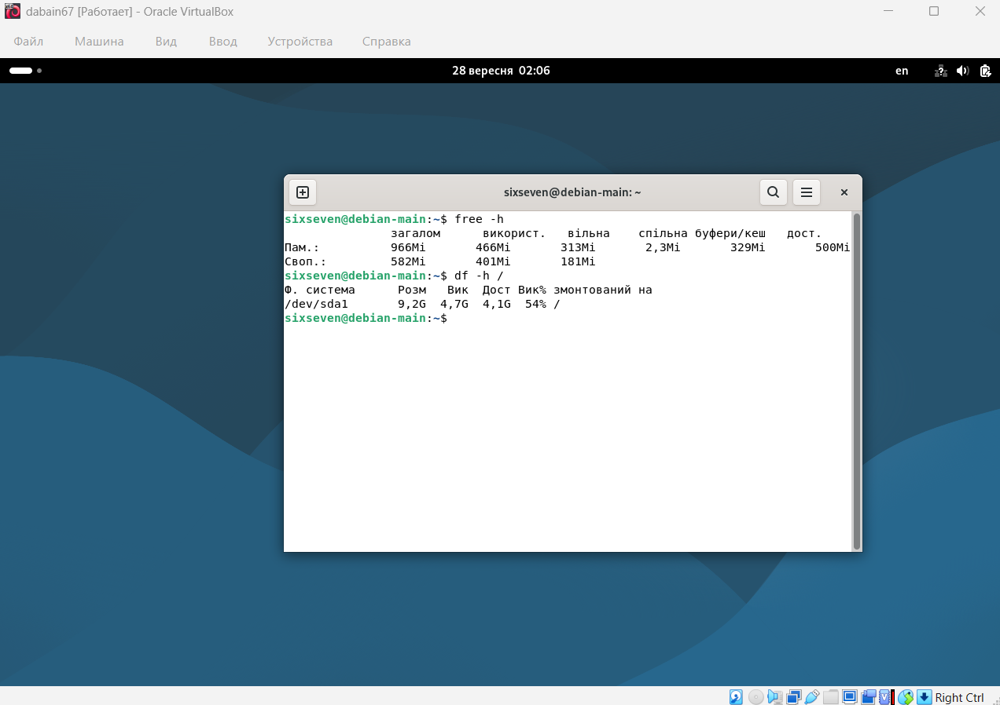
---
>Comitted by Олександр Безродних

## 4.3. Друга графічна оболонка: Xfce

Команда:

```bash
apt install xfce4 xfce4-goodies
```
Завдяки командам
# 1. Перейти в root (sudo для sixseven не налаштований)
```
su -
```
# 2. Оновити список пакетів
```
apt update
```
```
apt install xfce4 xfce4-goodies
```
# 3. Встановлення базового Xfce (пройшло успішно)
```
apt install xfce4
```
# 4. Перезавантаження
```
reboot
```
прямо у GNOME

Успішне встановлення `xfce4` (xfwm4, xfce4-panel, xfdesktop4, thunar).

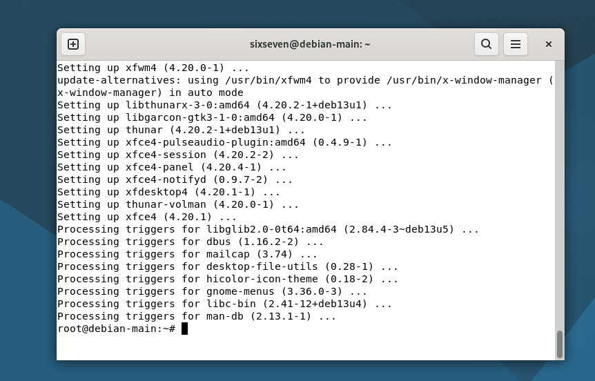

Робочий стіл Xfce (сесія обирається на екрані GDM через іконку-шестерню).

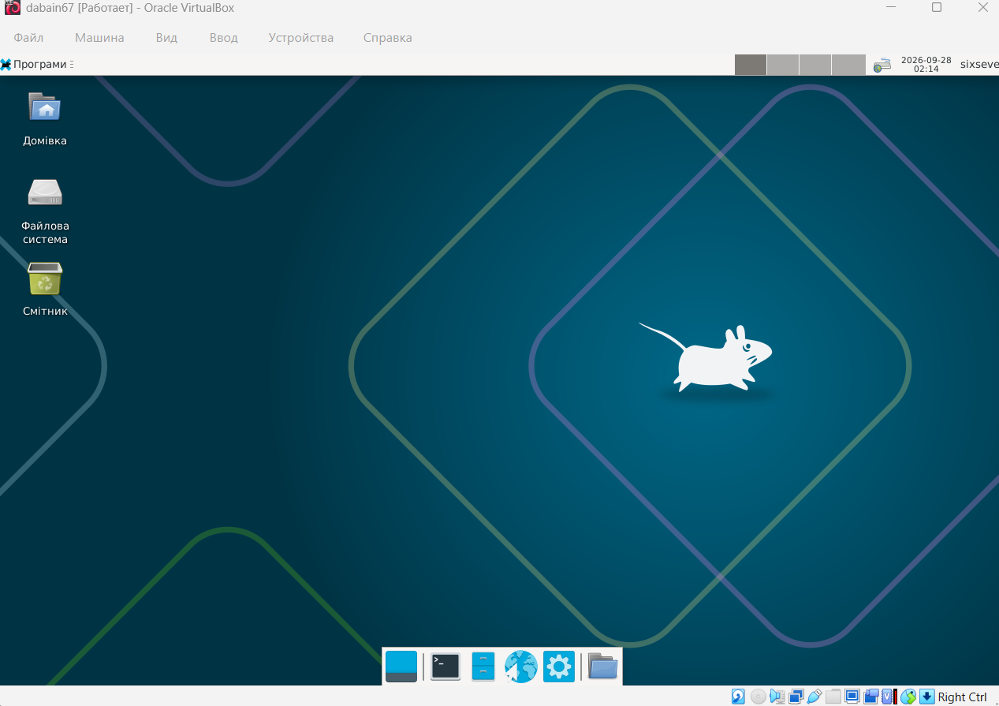

Використання ресурсів у сесії Xfce.

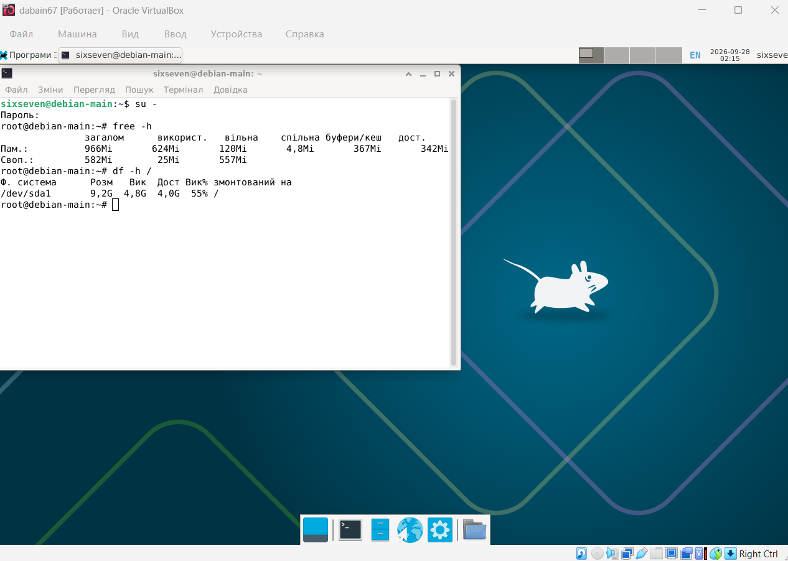

## 4.4. Порівняння GNOME та Xfce

| Критерій | GNOME | Xfce |
|---|---|---|
| Стиль інтерфейсу | Сучасний, Activities overview, тач-орієнтований | Класичний: панель + меню, схожий на Windows |
| Менеджер вікон | Mutter (Wayland/X11) | xfwm4 (X11) |
| Іконки на робочому столі | Відсутні за замовчуванням | Присутні (Домівка, Файлова система, Смітник) |
| Гнучкість налаштувань | Обмежена без розширень | Висока «з коробки» |
| Використана RAM (`free -h`) | 466 MiB | 624 MiB* |
| Використано диска (`df -h /`) | 4,7 ГБ (54%) | 4,8 ГБ (55%) |
| Типове споживання ізольовано | Вище | Нижче |

\* Обидві оболонки встановлені в одній системі, тому в сесії Xfce продовжують працювати фонові служби GNOME (gdm, dbus-сесії) і виміряне значення завищене. В ізольованій установці Xfce зазвичай легший за GNOME.

## Висновки
During the laboratory work, the Oracle VirtualBox Type-2 hypervisor was installed, and basic virtual machine management tasks—such as VM creation and the configuration of hardware, networking, and external storage—were explored. Two virtual machines running GNU/Linux were set up: the first with a standard configuration featuring an "out-of-the-box" graphical desktop environment (Ubuntu Desktop), and the second with a minimal text-based configuration (Debian netinst), followed by the sequential installation of two graphical desktop environments: GNOME and Xfce.
The comparison showed that GNOME offers a modern, stylized interface with limited customization flexibility unless extensions are used, whereas Xfce is a classic, lightweight, and far more customizable environment that is traditionally less resource-intensive when installed in isolation. The choice of a specific desktop environment depends on the workstation's hardware capabilities and the user's workflow preferences.
>Comitted by Клименко Назарій
